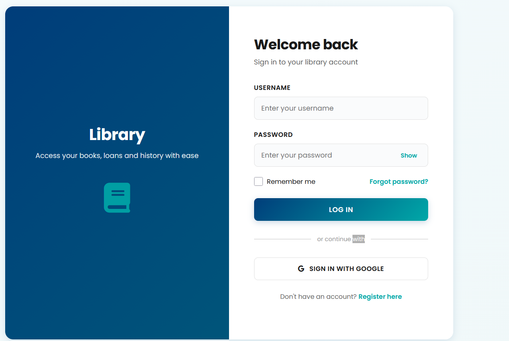
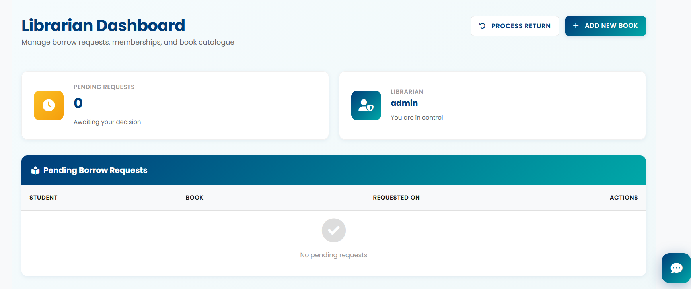

# 📚 Hall Library Management System — Portfolio Documentation

**🌐 Production Deployment URL:** [https://hall-library-management-system.onrender.com/](https://hall-library-management-system.onrender.com/)  

---

## 🛠️ Executive Summary & Architecture Blueprint

The **Hall Library Management System** is a production-ready, full-stack web platform built to modernize institutional book tracking, automated inventory accounting, and user member services. 

In engineering this system, the design choice was made to move away from legacy, transient file storage architectures toward a fully decoupled, **stateless cloud infrastructure** utilizing high-performance relational clustering and centralized cloud object storage pools. This ensures complete reliability on modern cloud providers entirely within a free hosting tier.

### 📸 Application Interface Previews

### 🔐 User Authentication & Unified Portal
*Secure access gateway featuring explicit role-based user separation, self-registration modules, and continuous Google Single Sign-On (SSO) integration.*


### 📊 Master Dashboard Workspace
*The central operations panel display. Provides administrators and members a transparent window into book lists, dynamic borrow counters, and individual account standing logs.*


---

## 🚀 Enterprise-Grade System Features

### 1. Robust Role-Based Access Control (RBAC) & Governance
* **Dual-Tier Account Ecosystem:** Implements absolute separation of concerns between standard patrons (Members) and system administrators (Staff/Librarians).
* **Secure Administration Desk:** Staff are provisioned with powerful inventory controls enabling them to introduce new book manifests, audit user activity feeds, and close outstanding borrow contracts.

### 2. Unified Third-Party Authentication (OAuth 2.0 Engine)
* **Google Single Sign-On (SSO):** Integrated securely with `django-allauth` to minimize customer onboarding friction while enforcing enterprise-grade credential management via Google Identity Services.
* **Automated Callback Routines:** Architected safe callback routing channels to reconcile external token exchanges cleanly inside local session memories without cross-origin conflicts.

### 3. Dynamic Inventory Analytics & Transaction Pipelines
* **Atomic Copy Buffering:** The catalog features real-time stock-tracking algorithms. When a book contract is opened, the system auto-decrements current shelf supply, instantly changing availability indices and dynamically blocking duplicate checkouts when count floors hit zero.
* **Full Lifecycle Telemetry:** Tracks issue dates, calculated due profiles, active states, and return confirmations to guarantee complete historical transparency.

### 4. Optimized Stateless Cloud Assets Storage
* **Decoupled File Pipeline:** Engineered to bypass ephemeral container environments by routing uploaded media streams dynamically to external cloud storage providers (Cloudinary) via custom backend adapter interfaces, resolving disappearing local asset errors completely.

---

## 💻 Technical Stack Architecture

* **Core Backend Framework:** Python 3.11 / Django 5.2.3 (Enforcing Model-View-Controller isolation)
* **Primary Database Engine:** PostgreSQL (Production-grade managed cluster instance via Render)
* **Object Storage Platform:** Cloudinary CDN Storage Network (Decoupled system uploads handler)
* **Static Asset Compiler:** Django Native Static Storage Engine
* **Client Interface Pipeline:** HTML5 / CSS3 / Bootstrap 5 / Django Widget Tweaks
* **Security & Encryption Layers:** PyJWT / Cryptography (Session and secure data signing)
* **WSGI HTTP Server Layer:** Gunicorn 26.0 (Green Unicorn production-grade process worker manager)

---

## 📂 System Topology Blueprint

```text
libraryBorrow/                     # Root Project Repository Core
├── manage.py                      # Django Master Command Utility CLI
├── requirements.txt               # Strict Production Package Manifest Dependencies
├── staticfiles/                   # Compiled Static Web Asset Targets
├── screenshots/                   # Documentation Interface Previews Folder
│   ├── login_view.png             # UI Asset: Secure Authorization Gate
│   └── dashboard_view.png         # UI Asset: Operational Control View
├── lib/                           # Central Application Engine (Business Logic)
│   ├── models.py                  # Database Schema Blueprints (Books, Profiles, Contracts)
│   ├── views.py                   # Request Processing & Presentation Logic Controllers
│   ├── urls.py                    # App-Isolated Route Mappings
│   └── templates/                 # Dynamic Server-Rendered Layout Files
└── libraryBorrow/                 # Master Project Configuration Core
    ├── settings.py                # Environment Keys, Storages Matrix, & App Parameters
    ├── urls.py                    # Top-Level Project URL Core Gateway Router
    └── wsgi.py                    # Web Server Gateway Interface Build Specification

---
```

* **🌍 Real-World Use Cases & Commercial Impact**

This application was engineered specifically to address operational inefficiencies inherent to paper-based tracking methods and manual spreadsheets:

> ### 🎓 Academic Reference Halls & Departments
> **Automates technical reference material distribution** across specific study circles. It cuts down research tracking delays by letting members monitor real-time copy availability instantly from their private devices.

> ### 🏢 Corporate & Private Asset Pools
> Provides technical centers or development houses with an **inner-loop environment** to manage shared hardware manuals, proprietary training indices, or localized reference licenses among internal personnel securely.

> ### 🏛️ Community Hubs & Youth Libraries
> Delivers an open-source, highly responsive framework for non-profit operations to organize community donations, handle high-volume user registration via **trusted Google OAuth profiles**, and eliminate book leakage through rigorous borrow lifecycle metrics.    

---

## 🚀 Local Implementation & Staging Environment Runbook

Follow these precise, sequential execution commands to clone, configure, and reproduce this environment from absolute scratch locally:

### 1. Repository Re-routing & Fetching
Clone the remote repository files down to your local computer and step directly into the working directory:
```bash
git clone [https://github.com/md-imam75/Hall-Library-Management-](https://github.com/md-imam75/Hall-Library-Management-)
cd libraryBorrow
```

2. Environmental Isolation Setup
```bash
python -m venv .venv
source .venv/Scripts/activate  # On Mac/Linux utilize: source .venv/bin/activate
```

3. Package Manifest Resolution
```bash
python -m pip install --upgrade pip setuptools wheel
pip install -r requirements.txt
```

4. Database Initialization & Compilations
```bash
python manage.py migrate
python manage.py collectstatic --noinput
python manage.py createsuperuser
```

5. Running the Local Engine
```bash
python manage.py runserver
```

🎯 Local Sandbox Gateway: Open your browser and navigate to http://127.0.0.1:8000/ to access the application dashboard.
